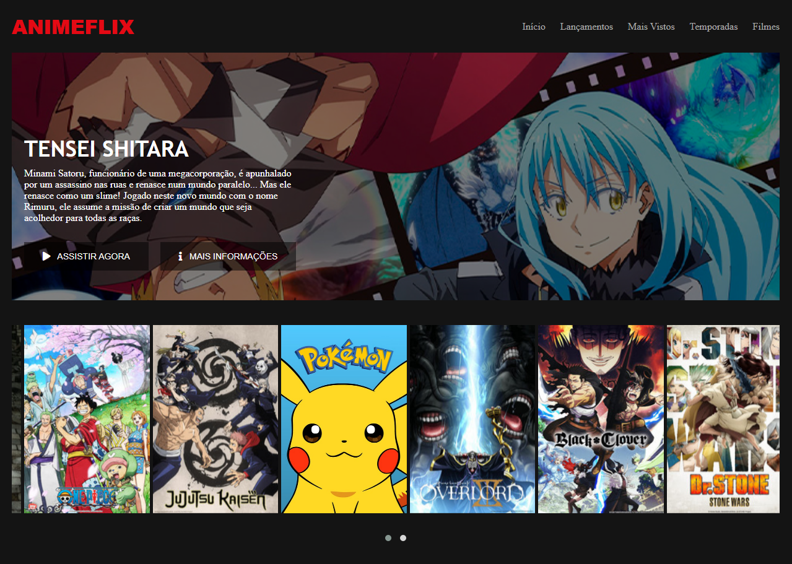

# Animeflix

Projeto feito como parte do desenvolvimento do bootcamp Localizalabs ReactJS, ofertado pela [Digital Innovation One](https://digitalinnovation.one/).
O intuito do projeto é recriar a interface Netflix com uma versão anime.

## Tecnologias

- [HTML](https://developer.mozilla.org/pt-BR/docs/Web/HTML)
- [CSS](https://developer.mozilla.org/pt-BR/docs/Web/CSS)
- [Javascript](https://developer.mozilla.org/pt-BR/docs/Web/JavaScript)
- [JQuery](https://jquery.com/)

### Créditos

[Felipe Silva Aguiar](https://www.linkedin.com/in/felipe-aguiar-047/)
